# Extension Pack for Visual Studio Code

- It includes all extension related to PHP, Magento, JQuery, HTMl & CSS, AI, Comments, Remote SSH and many more.

## Apache Conf

## Auto Close Tag

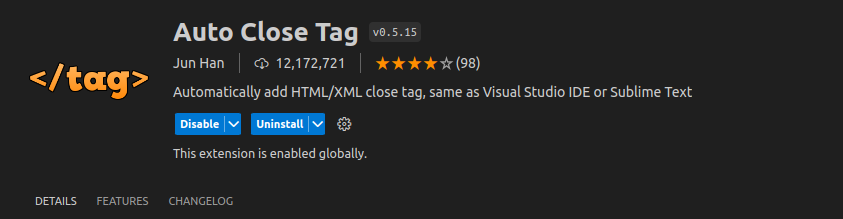

## Auto Rename Tag

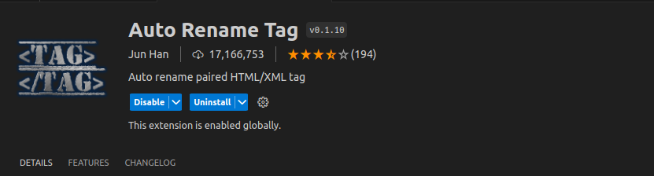

## AutoMageDev

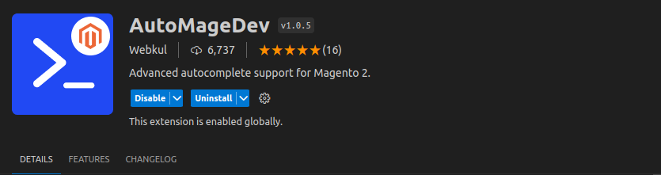

## Better Comments

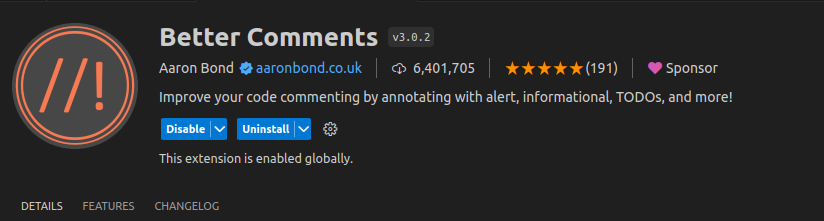

## Better PHPUnit

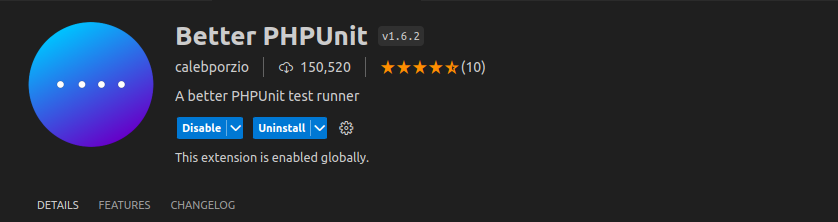

## ChatGPT GPT-4 - Bito AI Code Assistant

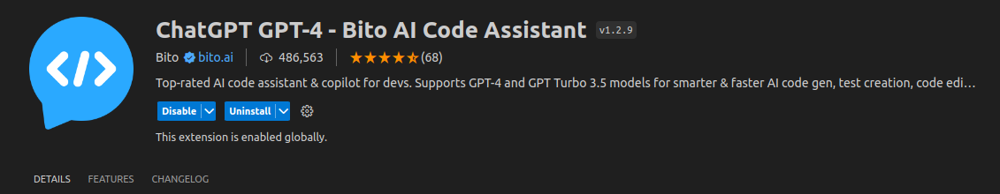

## Color Picker

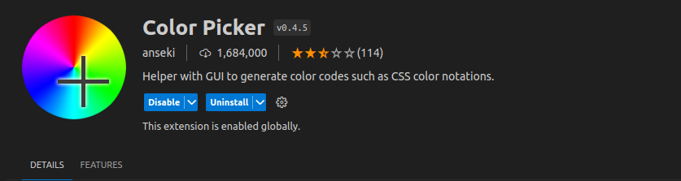

## Docker

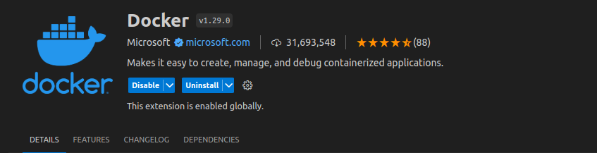

## Dev Containers

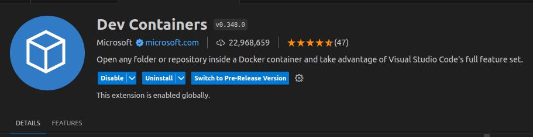

## Email

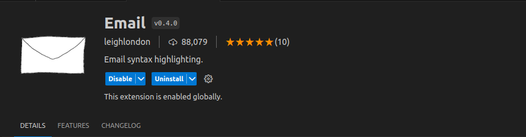

## GitLens — Git supercharged

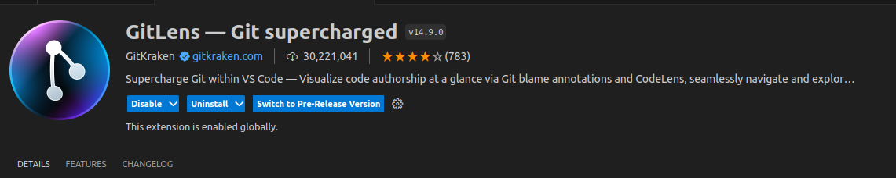

## GraphQL: Syntax Highlighting

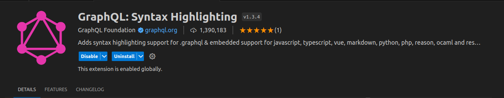

## IntelliPHP - AI Autocomplete for PHP

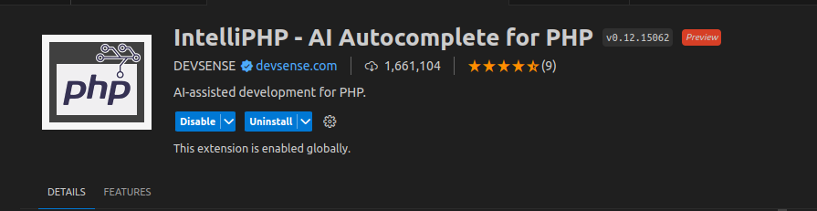

## jQuery Code Snippets

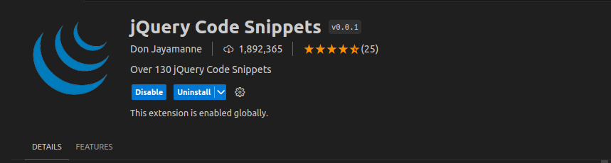

## jQuery Snippets

## Large file support for extensions

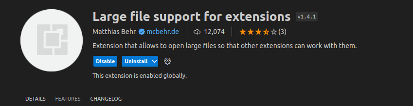

## LiveReload

## Magento 2 Snippets

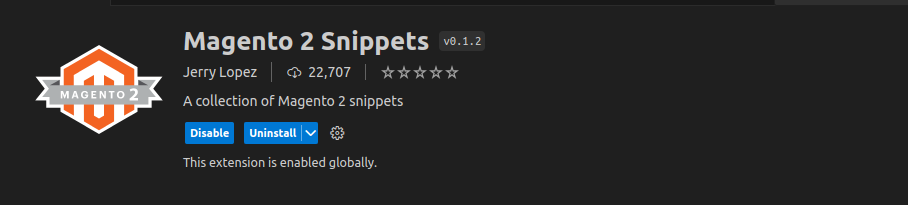

## Magento DevSearch

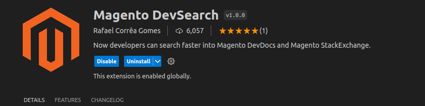

## MagentoWizard

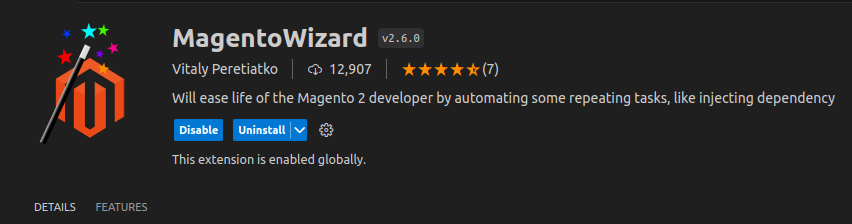

## Material Icon Theme

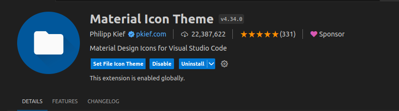

## Material Theme

## Material Theme Icons

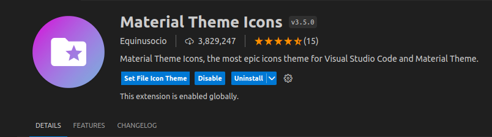

## Mintlify Doc Writer for Python, JavaScript, TypeScript, C++, PHP, Java, C#, Ruby & more

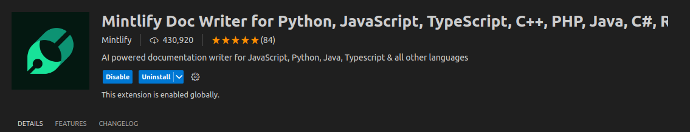

## Mithril Emmet

## NGINX Configuration

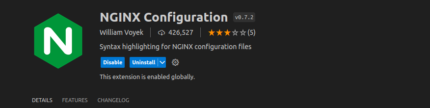

## NGINX Configuration Language Support

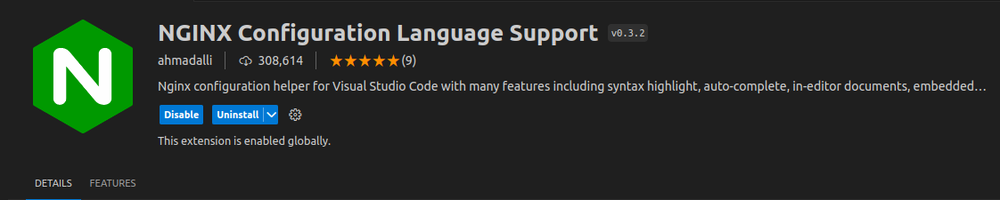

## nginx-formatter

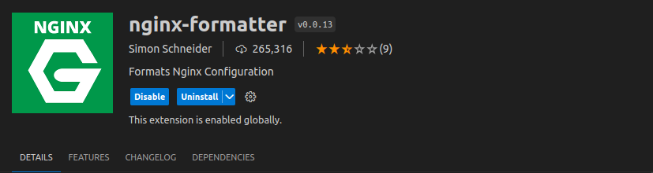

## PHP Awesome Snippets

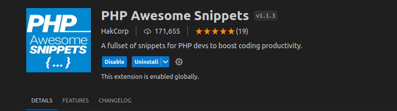

## PHP Constructor

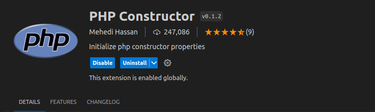

## PHP Debug

## PHP DocBlocker

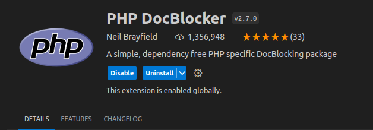

## PHP Getters & Setters

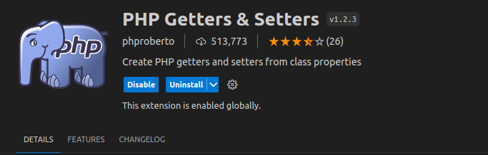

## PHP Intelephense

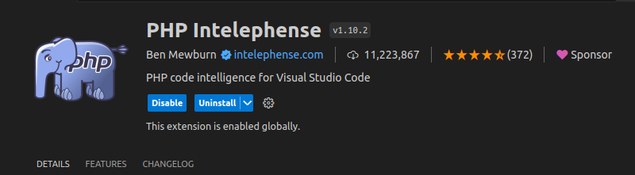

## PHP Support Utils

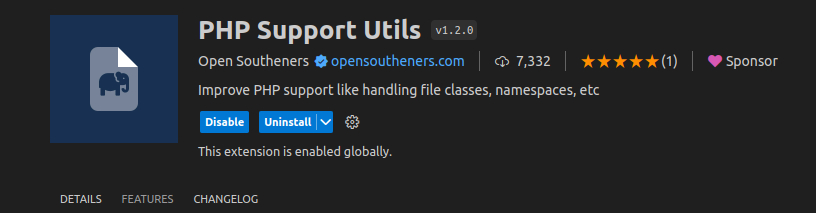

## PHPUnit Snippets

## Regex Previewer

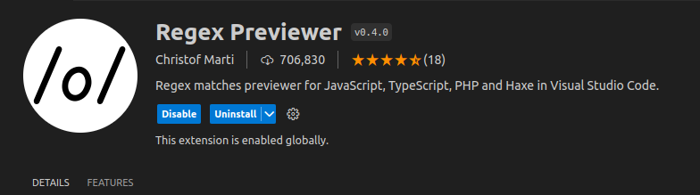

## Remote - SSH

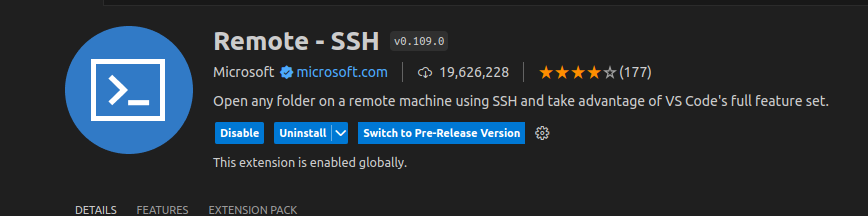

## Remote - SSH: Editing Configuration Files

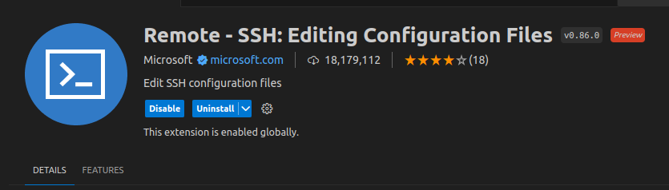

## Remote Explorer 

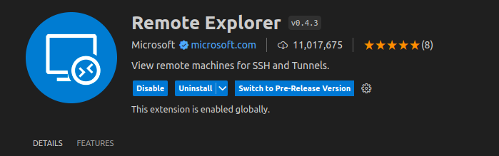

## Tabnine AI

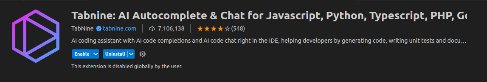

## Trailing Spaces

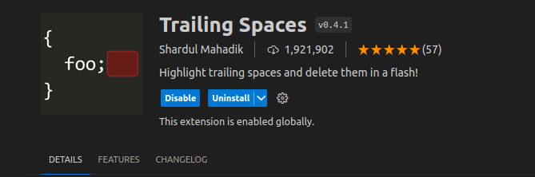

## XML Tools

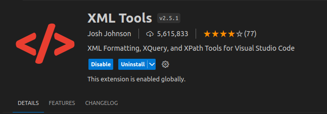

**Enjoy!**
