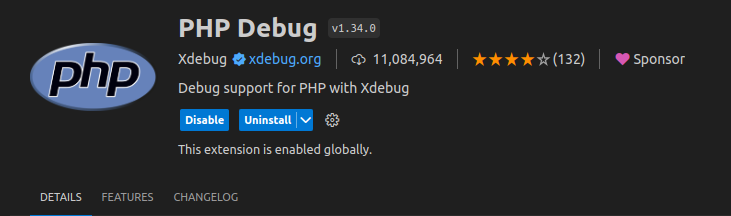
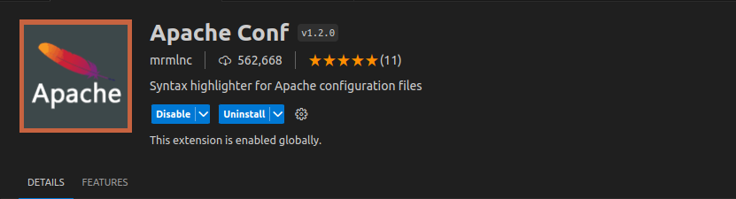

# Extension Pack for Magento

- It includes all extensions related to PHP, Magento, JQuery, HTMl & CSS, AI, Comments, Remote SSH and Apache & NGINX configuration, Docker, and XML.

## Install Magento Coding Standard
- Please follow this link for install magento coding standad. [Click Here](https://github.com/magento/magento-coding-standard)

- You can read my other document for vscode configuration. [Click Here](https://dipakp-docs.readthedocs.io/technical-guides/vscode/index.html)

# VS Code settings.json

Here is my vs code `settings.json`, you can [check here](https://gist.github.com/dipakp-logicrays/07f0b3b936e25dbe60067f2500b9ac47)

# List VS Code extensions

## AutoMageDev

## Magento 2 Snippets

## Magento DevSearch

## MagentoWizard

## Magento2 Language Server

## PHP Awesome Snippets

## PHP Constructor

## PHP Debug

## PHP DocBlocker

## PHP Getters & Setters

## PHP Intelephense

## PHP Namespace Resolver

## PHP Support Utils

## PHPUnit Snippets

## Auto Close Tag

## Auto Rename Tag

## Better Comments

## Better PHPUnit

## Color Picker

## Composer

## Docker

## Dev Containers

## GraphQL: Syntax Highlighting

## IntelliPHP - AI Autocomplete for PHP

## jQuery Code Snippets

## jQuery Snippets

## Large file support for extensions

## LiveReload

## Email

## GitLens — Git supercharged

## Markdown All in One

## Markdown Preview Enhanced

## Material Icon Theme

## Mintlify Doc Writer for Python, JavaScript, TypeScript, C++, PHP, Java, C#, Ruby & more

## Mithril Emmet

## Apache Conf

## NGINX Configuration

## Regex Previewer

## Remote - SSH

## Remote - SSH: Editing Configuration Files

## Remote Explorer

## ChatGPT GPT-4 - Bito AI Code Assistant

## Tabnine AI

## Trailing Spaces

## XML Tools

**Enjoy!**
